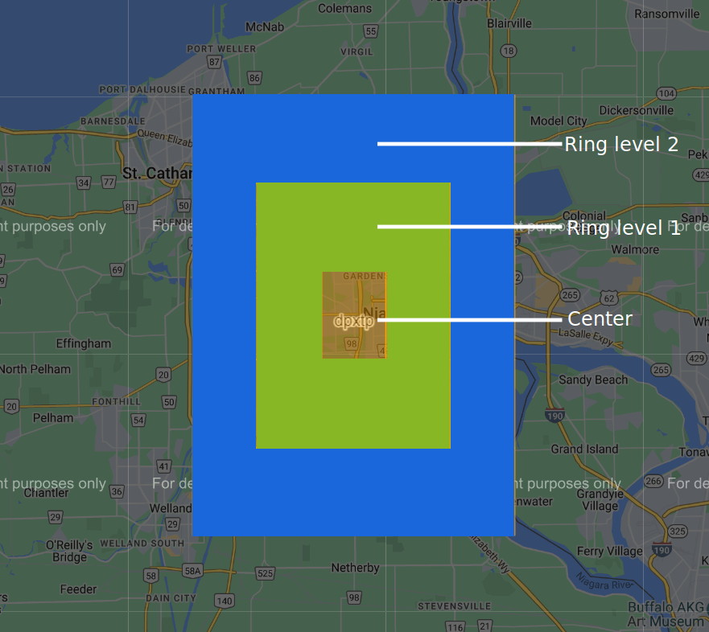

# Recursive Geohash Neighboring Ring Finder

## Overview

This Python script provides a solution to find neighboring geohashes in a recursive manner, forming concentric rings around a given center geohash cell. The primary motivation behind creating this script was the unavailability of an existing tool or library that could efficiently find geohashes within multiple rings surrounding a central geohash.

## Background
Geohashes are a widely used system to represent geographic coordinates as short strings, allowing spatial indexing and proximity-based searches. While finding immediate neighbors of a geohash cell is a standard feature in many geospatial libraries, finding neighboring geohashes in concentric rings up to a specified depth or level is a more specialized requirement.

## How It Works
The script leverages the geolib library to find the immediate neighbors of a given geohash cell. It takes the center geohash and user-specified ring level as input, which determines the number of rings surrounding the central geohash to be found. The output is a list of geohashes that form these concentric rings.



## Usage
To use the script, you need to have Python installed along with the geolib library. You can install the library using the following command:
```
pip install geolib
```
Then, simply copy and paste the provided Python script into your project or create a new Python file with this content.

## Function Signature

```
def get_neighbouring_ring(level: int, hashes: list) -> list:
```

## Parameters
- level (int): The depth of the ring, i.e., the number of concentric rings to be formed around the center geohash.
- hashes (list of str): A list containing the center geohash around which the rings will be formed.

## Return
The function returns a list of geohashes, including the center geohash and all neighboring geohashes within the specified number of concentric rings.

#### Test Example
```
level = 2   # input the depth of the ring
hashes = ['dpxtp']   # include only the center geohash of the ring

ring = get_neighbouring_ring(level, hashes)
print(ring)
```

## Important Notes
- Ensure that you have the geolib library installed before running the script.
- The level parameter must be a positive integer greater than 0, and hashes must be a list of strings.
- In case of incorrect inputs, the script will handle errors and return an empty list.
- You may use [site 1](https://bhargavchippada.github.io/mapviz) and [site 2](https://geohash.softeng.co/) to visualize geohash on the map.

## Contributing
If you find any issues, have suggestions for improvements, or want to contribute to this project, feel free to create a pull request or open an issue on the GitHub repository.